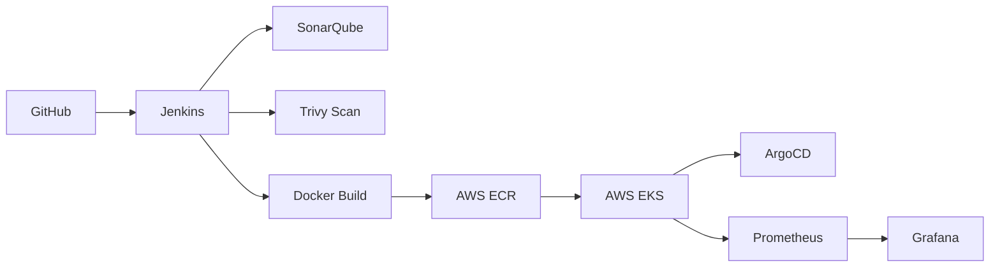

# 🚀 Amazon Prime Clone - DevOps Pipeline

A production-ready DevOps pipeline implementation for deploying an Amazon Prime clone, showcasing modern DevOps practices and tools integration.


## ✨ Features

- **Infrastructure as Code** - AWS infrastructure provisioning using Terraform
- **Containerization & Orchestration** - Docker containers managed by AWS EKS
- **Automated CI/CD Pipeline** - End-to-end automation with Jenkins and ArgoCD
- **Security First** - Integrated security scanning with Aqua Trivy
- **Quality Assurance** - Automated code analysis with SonarQube
- **Monitoring & Observability** - Prometheus & Grafana integration

## 🏗️ Architecture



## 🚀 Quick Start

### Prerequisites

- AWS Account with appropriate permissions
- AWS CLI configured on your machine
- Terraform installed
- Docker installed
- kubectl installed
- Git installed

### One-Click Setup

```bash
# Clone the repository
git clone https://github.com/yourusername/amazon-prime-clone.git
cd amazon-prime-clone

# Initialize and deploy infrastructure
terraform init
terraform apply --auto-approve
```

## 🛠️ Pipeline Stages

1. **Source Control**
   - Code checkout from GitHub

2. **Code Quality**
   - SonarQube analysis
   - Quality gate validation

3. **Security**
   - Trivy vulnerability scanning
   - Container image scanning

4. **Build & Push**
   - Docker image creation
   - Push to AWS ECR

5. **Deployment**
   - ArgoCD deployment to EKS
   - Service exposure

6. **Monitoring**
   - Prometheus metrics collection
   - Grafana dashboard visualization

## 📊 Monitoring

Access your monitoring dashboards:

- **Grafana**: `http://<LOAD_BALANCER_IP>`
- **Prometheus**: `http://<LOAD_BALANCER_IP>:9090`

## 🔐 Security Configurations

Default credentials (remember to change):

- **Jenkins**: admin/admin
- **SonarQube**: admin/admin
- **Grafana**: admin/admin

## 🧰 Tools & Technologies

| Category | Tools |
|----------|-------|
| Infrastructure | AWS, Terraform |
| CI/CD | Jenkins, ArgoCD |
| Containerization | Docker, Kubernetes |
| Security | Aqua Trivy, SonarQube |
| Monitoring | Prometheus, Grafana |

## 🔍 Troubleshooting

Common issues and solutions:

1. **Jenkins Pipeline Fails**
   - Verify AWS credentials
   - Check ECR permissions

2. **EKS Cluster Issues**
   - Validate kubectl configuration
   - Check node group status

## 🧹 Cleanup

Run the cleanup script to remove all resources:

```bash
# Clean up Kubernetes resources
kubectl delete -f k8s/

# Destroy infrastructure
terraform destroy --auto-approve
```

## 🤝 Contributing

1. Fork the repository
2. Create a feature branch
3. Commit your changes
4. Push to the branch
5. Open a pull request

## 📞 Contact 

For contact mail:mohdrihan1909@gmail.com

---
⭐ Star this repository if you find it helpful!
